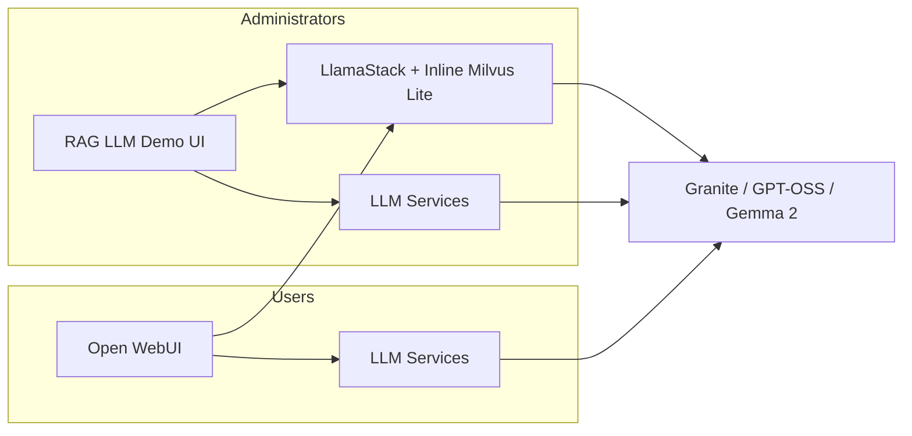
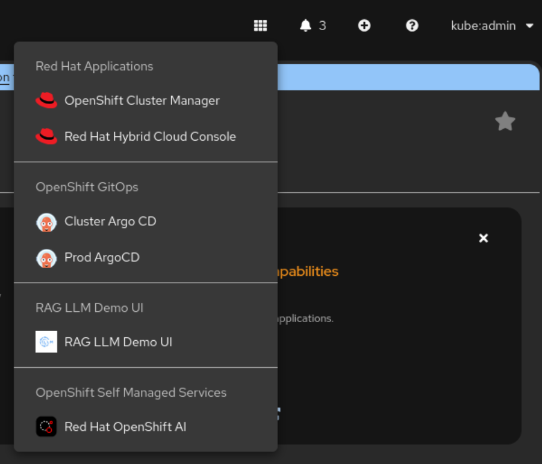

# RAG LLM Pattern on OpenShift AI 3.x Single Node Openshift

**Repository:** [github.com/RedCupofJoe/rhoai-3x-rag-llm-sno](https://github.com/RedCupofJoe/rhoai-3x-rag-llm-sno)

## Overview

This Validated Pattern deploys a Retrieval-Augmented Generation (RAG) Large Language Model (LLM) infrastructure on **Red Hat OpenShift AI 3.x**, suitable for a Single Node OpenShift (SNO) cluster. It provides a GPU-accelerated environment for running LLM inference services using vLLM with **IBM Granite 4 Small**, **GPT-OSS 120B**, and **Google Gemma 2** models, and **exposes endpoints** for the deployed models.

The pattern provides **two frontends**—**RAG LLM Demo UI** (administrators) and **Open WebUI** (users)—both using the **inline Milvus Lite** vector database via the OpenShift AI Llama Stack. A single LlamaStackDistribution hosts Milvus Lite; both UIs call the Llama Stack API for RAG.

The repository is intended to be deployed on an **existing OpenShift cluster (4.20+) with OpenShift AI 3.0 installed**, or the pattern can install OpenShift AI 3.x via the `fast-3.x` channel as part of the deployment.



## Applications & Components

### LLM Inference Services
- [**IBM Granite 4 Small**](https://huggingface.co/ibm-granite/granite-4.0-h-small) - Served via vLLM with GPU acceleration
- [**GPT-OSS 120B**](https://huggingface.co/openai/gpt-oss-120b) - **Optional.** Served via vLLM; schedules only on nodes with **H100 or higher** (node affinity on `nvidia.com/gpu.product`). If no such GPU exists, the predictor stays Pending and other models are unaffected.
- [**Google Gemma 2**](https://huggingface.co/google/gemma-2-2b) - Served via vLLM with GPU acceleration

### Vector store and RAG
- **Inline Milvus Lite** (OpenShift AI Llama Stack) - Single vector database for **both** administrators and users. It runs embedded in the LlamaStackDistribution pod. **Both frontends** use the Llama Stack API for RAG (which uses inline Milvus Lite). Ingest content via Jupyter/`llama_stack_client` or Docling; see [OpenShift AI Llama Stack docs](https://docs.redhat.com/en/documentation/red_hat_openshift_ai_self-managed/3.0/html/working_with_llama_stack/deploying-a-rag-stack-in-a-project_rag).

### Frontends
- [**RAG LLM Demo UI**](https://github.com/validatedpatterns-sandbox/rag-llm-demo-ui) - **Administrator** interface: RAG via LlamaStack (inline Milvus Lite), plus direct access to Granite, GPT-OSS, and Gemma 2.
- [**Open WebUI**](https://github.com/open-webui/open-webui) - **User** interface: chat and RAG via the same LlamaStack (inline Milvus Lite) and the three inference services (Granite, GPT-OSS, Gemma 2).

### Supporting Operators
- [**Red Hat OpenShift AI 3.x**](https://docs.redhat.com/en/documentation/red_hat_openshift_ai_self-managed/3.2) - AI/ML platform for model serving (KServe single-model serving). The pattern uses the **fast-3.x** channel when installing the operator.
- [**cert-manager**](https://cert-manager.io/) - Required by OpenShift AI for the KServe model serving platform.
- [**NVIDIA GPU Operator**](https://docs.nvidia.com/datacenter/cloud-native/openshift/latest/introduction.html) - Provides GPU support for the inference services.
- [**Node Feature Discovery (NFD)**](https://github.com/openshift/cluster-nfd-operator) - Identifies node hardware capabilities.
- [**Local Volume Management Service (LVMS)**](https://github.com/openshift/lvm-operator) - Manages local storage volumes.

## Prerequisites

- [**OpenShift Cluster 4.20+**](https://docs.redhat.com/en/documentation/openshift_container_platform/4.20/html/installing_on_a_single_node/install-sno-installing-sno) - Including Single Node OpenShift (SNO). OpenShift AI 3.x requires 4.19 or later.
- **OpenShift AI 3.0** - Either already installed on the cluster, or the pattern will install it (subscription channel `fast-3.x`).
- **SNO target:** [**Cisco UCS**](https://www.cisco.com/c/en/us/products/servers-unified-computing/index.html) server with 2x [**NVIDIA H100**](https://www.nvidia.com/en-us/data-center/h100/) GPUs and **500GB memory** for running all inference services. GPT-OSS 120B is **optional** and only runs when at least one node has an H100 or higher (e.g. H200); clusters without H100+ will run Granite and Gemma 2 only, with the GPT-OSS predictor remaining Pending.

If your hardware differs (e.g., different GPU or memory), adjust resource limits and model selection in the pattern overrides accordingly. To add more GPU products (e.g. future NVIDIA datacenter GPUs) for GPT-OSS scheduling, edit the `nvidia.com/gpu.product` values in `overrides/gpt-oss-inference-service-values.yaml`.

## Installation

### Standard Installation

1. Clone this repository:
   ```bash
   git clone https://github.com/RedCupofJoe/rhoai-3x-rag-llm-sno.git
   cd rhoai-3x-rag-llm-sno
   ```

2. Log into your OpenShift cluster:
   ```bash
   export KUBECONFIG=/path/to/your/kubeconfig
   ```
   Or:
   ```bash
   oc login --token=<your-token> --server=<your-cluster-api>
   ```

3. Install the pattern. This will **first ensure Argo CD (OpenShift GitOps Operator) is installed** (and install it if missing), then verify OpenShift AI 3.0 operators, then deploy the pattern:
   ```bash
   ./pattern.sh make install
   ```
   To run only the Argo CD check/install: `./pattern.sh make check-argocd`. To run only the OpenShift AI check: `./pattern.sh make check-openshift-ai-operators`.

### Custom Installation

If your hardware differs from the tested configuration (Cisco UCS with 2x H100, 500GB memory) or you need to modify the pattern:

1. Fork this repository and clone your fork (or clone this repo directly):
   ```bash
   git clone https://github.com/RedCupofJoe/rhoai-3x-rag-llm-sno.git
   cd rhoai-3x-rag-llm-sno
   ```

2. Create a branch for your changes:
   ```bash
   git checkout -b my-customizations
   ```

3. Make your modifications (e.g., adjust model configurations, resource limits)

4. Commit and push your changes:
   ```bash
   git add .
   git commit -m "Customize pattern for my environment"
   git push -u origin my-customizations
   ```

5. Log into your OpenShift cluster:
   ```bash
   export KUBECONFIG=/path/to/your/kubeconfig
   ```
   Or:
   ```bash
   oc login --token=<your-token> --server=<your-cluster-api>
   ```

6. Install the pattern:
   ```bash
   ./pattern.sh make install
   ```

## Usage

After installation, access the pattern components from the OpenShift console's application menu (bento box):



From here you can:
- **Cluster Argo CD / Prod ArgoCD** - View the GitOps installation and sync status of the pattern
- **RAG LLM Demo UI** - Administrator interface (Qdrant-backed RAG, all three models)
- **Open WebUI** - User-facing chat and RAG frontend
- **Red Hat OpenShift AI** - Access the OpenShift AI dashboard

### Model and application endpoints

After deployment, the pattern exposes **endpoints for the deployed models** (Granite 4 Small, GPT-OSS 120B, and Gemma 2), **both frontends**, and **LlamaStack** (inline Milvus Lite) for RAG. For internal URLs, external Route URLs, and how to call the OpenAI-compatible inference API, see **[docs/ENDPOINTS.md](docs/ENDPOINTS.md)**.

### Using the frontends

- **RAG LLM Demo UI (administrators)** – Use the route for `rag-llm-frontend` in `rag-llm-sno`. Select an LLM: Granite, GPT-OSS, Gemma 2, or **LlamaStack** for RAG over the shared **inline Milvus Lite** vector store.
- **Open WebUI (users)** – Use the route or port-forward for `openwebui` in `rag-llm-sno`. Chat with Granite, GPT-OSS, Gemma 2, or select **LlamaStack** for RAG over the same **inline Milvus Lite** store. Ingest documents into Milvus Lite via Jupyter/`llama_stack_client` or Docling; see the [Llama Stack documentation](https://docs.redhat.com/en/documentation/red_hat_openshift_ai_self-managed/3.0/html/working_with_llama_stack/deploying-a-rag-stack-in-a-project_rag).
