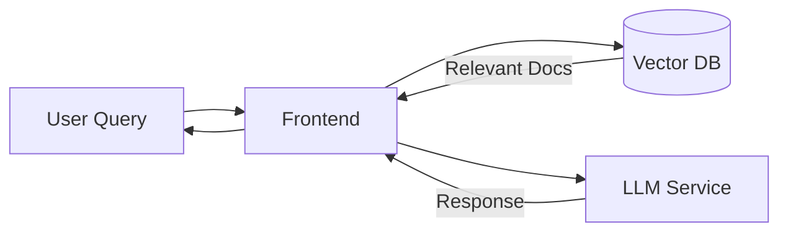

# RAG LLM Pattern on OpenShift AI 3.x Single Node Openshift

## Overview

This Validated Pattern deploys a Retrieval-Augmented Generation (RAG) Large Language Model (LLM) infrastructure on **Red Hat OpenShift AI 3.x**, suitable for a Single Node OpenShift (SNO) cluster. It provides a GPU-accelerated environment for running LLM inference services using vLLM with both IBM Granite 4 Small and GPT-OSS 120B models, and **exposes endpoints** for the deployed models.

In addition to the LLM inference services, the pattern deploys Qdrant as a vector database, pre-populated with the Validated Patterns documentation. A frontend application is also included, allowing users to select an LLM, configure retrieval settings, and query the complete RAG pipeline.

The repository is intended to be deployed on an **existing OpenShift cluster (4.20+) with OpenShift AI 3.0 installed**, or the pattern can install OpenShift AI 3.x via the `fast-3.x` channel as part of the deployment.



## Applications & Components

### LLM Inference Services
- [**IBM Granite 4 Small**](https://huggingface.co/ibm-granite/granite-4.0-h-small) - Served via vLLM with GPU acceleration
- [**GPT-OSS 120B**](https://huggingface.co/openai/gpt-oss-120b) - Served via vLLM with GPU acceleration

### Vector Database
- [**Qdrant**](https://github.com/qdrant/qdrant) - Vector database pre-populated with Validated Patterns documentation for retrieval

### Frontend
- [**RAG Frontend Application**](https://github.com/validatedpatterns-sandbox/rag-llm-demo-ui) - Web interface for selecting an LLM, configuring retrieval settings, and querying the RAG pipeline

### Supporting Operators
- [**Red Hat OpenShift AI 3.x**](https://docs.redhat.com/en/documentation/red_hat_openshift_ai_self-managed/3.2) - AI/ML platform for model serving (KServe single-model serving). The pattern uses the **fast-3.x** channel when installing the operator.
- [**cert-manager**](https://cert-manager.io/) - Required by OpenShift AI for the KServe model serving platform.
- [**NVIDIA GPU Operator**](https://docs.nvidia.com/datacenter/cloud-native/openshift/latest/introduction.html) - Provides GPU support for the inference services.
- [**Node Feature Discovery (NFD)**](https://github.com/openshift/cluster-nfd-operator) - Identifies node hardware capabilities.
- [**Local Volume Management Service (LVMS)**](https://github.com/openshift/lvm-operator) - Manages local storage volumes.

## Prerequisites

- [**OpenShift Cluster 4.20+**](https://docs.redhat.com/en/documentation/openshift_container_platform/4.20/html/installing_on_a_single_node/install-sno-installing-sno) - Including Single Node OpenShift (SNO). OpenShift AI 3.x requires 4.19 or later.
- **OpenShift AI 3.0** - Either already installed on the cluster, or the pattern will install it (subscription channel `fast-3.x`).
- **SNO target:** [**Cisco UCS**](https://www.cisco.com/c/en/us/products/servers-unified-computing/index.html) server with 2x [**NVIDIA H100**](https://www.nvidia.com/en-us/data-center/h100/) GPUs and **500GB memory** for running both LLM inference services and the rest of the stack. At least 80GB GPU VRAM per GPU is recommended for the GPT-OSS 120B model.

If your hardware differs (e.g., different GPU or memory), adjust resource limits and model selection in the pattern overrides accordingly.

## Installation

### Standard Installation

1. Clone this repository:
   ```bash
   git clone https://github.com/validatedpatterns-sandbox/rag-llm-sno.git
   cd rag-llm-sno
   ```

2. Log into your OpenShift cluster:
   ```bash
   export KUBECONFIG=/path/to/your/kubeconfig
   ```
   Or:
   ```bash
   oc login --token=<your-token> --server=<your-cluster-api>
   ```

3. Install the pattern:
   ```bash
   ./pattern.sh make install
   ```

### Custom Installation

If your hardware differs from the tested configuration (Cisco UCS with 2x H100, 500GB memory) or you need to modify the pattern:

1. Fork this repository and clone your fork:
   ```bash
   git clone https://github.com/<your-username>/rag-llm-sno.git
   cd rag-llm-sno
   ```

2. Create a branch for your changes:
   ```bash
   git checkout -b my-customizations
   ```

3. Make your modifications (e.g., adjust model configurations, resource limits)

4. Commit and push your changes:
   ```bash
   git add .
   git commit -m "Customize pattern for my environment"
   git push -u origin my-customizations
   ```

5. Log into your OpenShift cluster:
   ```bash
   export KUBECONFIG=/path/to/your/kubeconfig
   ```
   Or:
   ```bash
   oc login --token=<your-token> --server=<your-cluster-api>
   ```

6. Install the pattern:
   ```bash
   ./pattern.sh make install
   ```

## Usage

After installation, access the pattern components from the OpenShift console's application menu (bento box):


From here you can:
- **Cluster Argo CD / Prod ArgoCD** - View the GitOps installation and sync status of the pattern
- **RAG LLM Demo UI** - Launch the frontend application
- **Red Hat OpenShift AI** - Access the OpenShift AI dashboard

### Model and application endpoints

After deployment, the pattern exposes **endpoints for the deployed models** (Granite 4 Small and GPT-OSS 120B) and the RAG frontend. For internal URLs, external Route URLs, and how to call the OpenAI-compatible inference API, see **[docs/ENDPOINTS.md](docs/ENDPOINTS.md)**.

### Using the Frontend

The RAG LLM Demo UI provides an interface to query the RAG pipeline:


1. **Select an LLM** - Choose between the available models (IBM Granite 4 Small or GPT-OSS 120B)
2. **Configure Retrieval Settings** - Adjust search type (similarity, similarity_score_threshold, or mmr) and parameters like number of documents to retrieve
3. **Submit your query** - Enter a question and view the response along with retrieved documents
