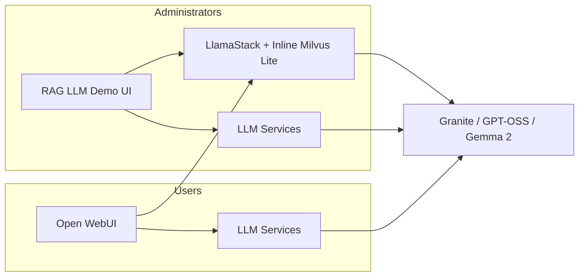
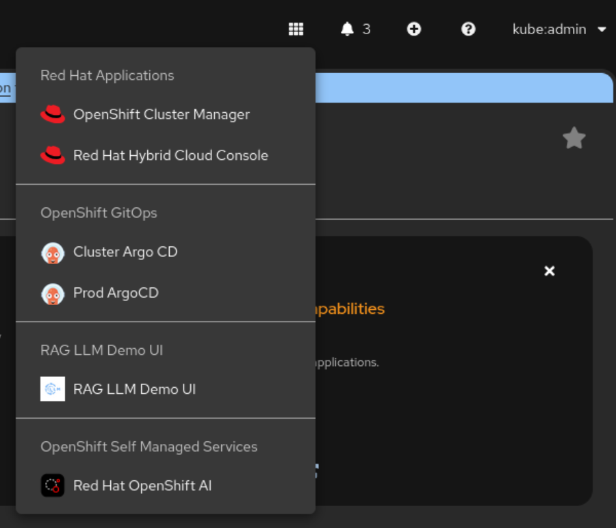

# RAG LLM Pattern on OpenShift AI 3.x Single Node Openshift

**Repository:** [github.com/RedCupofJoe/rhoai-3x-rag-llm-sno](https://github.com/RedCupofJoe/rhoai-3x-rag-llm-sno)

## Overview

This Validated Pattern deploys a Retrieval-Augmented Generation (RAG) Large Language Model (LLM) infrastructure on **Red Hat OpenShift AI 3.x**, suitable for a Single Node OpenShift (SNO) cluster. It provides a GPU-accelerated environment for running LLM inference services using vLLM with **IBM Granite 4 Small**, **GPT-OSS 20B** (default when &lt; 80GB VRAM), **GPT-OSS 120B** (when ≥ 80GB VRAM), and **Google Gemma 2** models, and **exposes endpoints** for the deployed models.

The pattern provides **two frontends**—**RAG LLM Demo UI** (administrators) and **Open WebUI** (users)—both using the **inline Milvus Lite** vector database via the OpenShift AI Llama Stack. A single LlamaStackDistribution hosts Milvus Lite; both UIs call the Llama Stack API for RAG.

The pattern installs **OpenShift AI** (`rhods-operator`) via GitOps. **OpenShift Service Mesh** and **OpenShift Serverless** must be installed **first** (Operator Hub), in Red Hat’s documented order—managing them in the same GitOps bundle as OpenShift AI often triggers **`intersecting operatorgroups provide the same apis`**. See **[docs/OPERATORGROUP-INTERSECTING.md](docs/OPERATORGROUP-INTERSECTING.md)**.


```mermaid
flowchart LR
    subgraph Admin["Administrators"]
      AdminUI[RAG LLM Demo UI]
      AdminUI --> LlamaStack[LlamaStack + Inline Milvus Lite]
      AdminUI --> LLM1[LLM Services]
    end
    subgraph Users["Users"]
      OpenWebUI[Open WebUI]
      OpenWebUI --> LlamaStack
      OpenWebUI --> LLM2[LLM Services]
    end
    LlamaStack --> Granite[Granite / GPT-OSS / Gemma 2]
    LLM1 --> Granite
    LLM2 --> Granite
```

## Applications & Components

### LLM Inference Services
- [**IBM Granite 4 Small**](https://huggingface.co/ibm-granite/granite-4.0-h-small) - Served via vLLM with GPU acceleration
- [**GPT-OSS 20B**](https://huggingface.co/openai/gpt-oss-20b) - **Default when &lt; 80GB VRAM.** Served via vLLM; schedules on any node with an NVIDIA GPU. Use this on clusters without 80GB+ VRAM per node.
- [**GPT-OSS 120B**](https://huggingface.co/openai/gpt-oss-120b) - **Optional.** Served via vLLM; schedules only on nodes with **≥ 80GB VRAM** (e.g. H100 80GB, H200 141GB; node affinity on `nvidia.com/gpu.product`). If no such GPU exists, the 120B predictor stays Pending; OSS-20B remains available.
- [**Google Gemma 2**](https://huggingface.co/google/gemma-2-2b) - Served via vLLM with GPU acceleration

### Vector store and RAG
- **Inline Milvus Lite** (OpenShift AI Llama Stack) - Single vector database for **both** administrators and users. It runs embedded in the LlamaStackDistribution pod. **Both frontends** use the Llama Stack API for RAG (which uses inline Milvus Lite). Ingest content via Jupyter/`llama_stack_client` or Docling; see [OpenShift AI Llama Stack docs](https://docs.redhat.com/en/documentation/red_hat_openshift_ai_self-managed/3.0/html/working_with_llama_stack/deploying-a-rag-stack-in-a-project_rag).

### Frontends
- [**RAG LLM Demo UI**](https://github.com/validatedpatterns-sandbox/rag-llm-demo-ui) - **Administrator** interface: RAG via LlamaStack (inline Milvus Lite), plus direct access to Granite, GPT-OSS 20B/120B, and Gemma 2.
- [**Open WebUI**](https://github.com/open-webui/open-webui) - **User** interface: chat and RAG via the same LlamaStack (inline Milvus Lite) and the inference services (Granite, OSS-20B by default, OSS-120B when ≥ 80GB VRAM, Gemma 2).

### Supporting Operators
- [**Red Hat OpenShift AI 3.x**](https://docs.redhat.com/en/documentation/red_hat_openshift_ai_self-managed/3.2) - AI/ML platform for model serving (KServe). Installed by the pattern (**fast-3.x**). Requires Service Mesh + Serverless (see Prerequisites).
- [**cert-manager Operator for Red Hat OpenShift**](https://docs.redhat.com/en/documentation/openshift_container_platform/latest/html/security_and_compliance/cert-manager-operator-for-red-hat-openshift) - Required by OpenShift AI for the KServe model serving platform. Use the Red Hat operator (`openshift-cert-manager-operator`) from `redhat-operators`, not the community cert-manager.
- [**NVIDIA GPU Operator (Red Hat Certified)**](https://catalog.redhat.com/en/software/container-stacks/detail/5faa9cb6b72282d84b742c6e) - Provides GPU support for the inference services. The pattern uses the **Red Hat Certified Operator** (`gpu-operator-certified` from `certified-operators`), not the community operator.
- [**Node Feature Discovery (NFD)**](https://github.com/openshift/cluster-nfd-operator) - Identifies node hardware capabilities (**omitted** on the **`prod-cloud`** profile — see below).
- [**Local Volume Management Service (LVMS)**](https://github.com/openshift/lvm-operator) - Manages local storage volumes.

## Prerequisites

- **HashiCorp Vault is not required** — model pulls use public Hugging Face images by default; use OpenShift AI workbench secrets if you need private registry tokens.
- [**OpenShift Cluster 4.20+**](https://docs.redhat.com/en/documentation/openshift_container_platform/4.20/html/installing_on_a_single_node/install-sno-installing-sno) - Including Single Node OpenShift (SNO). OpenShift AI 3.x requires 4.19 or later.
- **Before this pattern:** Install **[OpenShift Service Mesh](https://docs.redhat.com/en/documentation/openshift_container_platform/latest/html/service_mesh/)** and **[OpenShift Serverless](https://docs.redhat.com/en/documentation/openshift_serverless/latest/html/installing_serverless/installing-openshift-serverless)** from **Operator Hub** (KServe / single-model serving depends on them). Doing this **outside** GitOps avoids OperatorGroup conflicts with OpenShift AI.
- **OpenShift AI 3.x** - Installed by this pattern (`fast-3.x`) unless already present.
- **SNO target:** [**Cisco UCS**](https://www.cisco.com/c/en/us/products/servers-unified-computing/index.html) server with 2x [**NVIDIA H100**](https://www.nvidia.com/en-us/data-center/h100/) GPUs and **500GB memory** for running all inference services. The pattern **defaults to GPT-OSS 20B** when no node has ≥ 80GB VRAM; **GPT-OSS 120B** runs when at least one node has ≥ 80GB VRAM (e.g. H100 80GB, H200 141GB).

If your hardware differs (e.g., different GPU or memory), adjust resource limits and model selection in the pattern overrides accordingly. To add more GPU products for the 120B service (≥ 80GB VRAM), edit `nvidia.com/gpu.product` in `overrides/gpt-oss-inference-service-values.yaml`.

### Cloud GPU + OpenShift AI model catalog (`prod-cloud`)

For **cloud MachineSet GPU nodes** (AWS/Azure/GCP) and serving models **from the OpenShift AI model catalog** (dashboard) instead of GitOps vLLM + Hugging Face:

1. Set **`main.clusterGroupName: prod-cloud`** in **`values-global.yaml`**.
2. Use **`values-prod-cloud.yaml`**, which **skips NFD** and the four GitOps InferenceService apps.
3. After OpenShift AI is ready, **deploy models from the model catalog**, then edit **`overrides/*-cloud-catalog-values.yaml`** with your predictor URLs and commit.

Full steps: **[docs/CLOUD-AND-MODEL-CATALOG.md](docs/CLOUD-AND-MODEL-CATALOG.md)**.

## Deployment order (sync waves)

Argo CD **sync waves** order operator installs, the Data Science Cluster, vLLM runtimes/services, LlamaStack, and UIs. See **[docs/SYNC-WAVES.md](docs/SYNC-WAVES.md)** for the full table (`prod` and **`prod-cloud`**).

## Installation

### Standard Installation

1. Clone this repository:
   ```bash
   git clone https://github.com/RedCupofJoe/rhoai-3x-rag-llm-sno.git
   cd rhoai-3x-rag-llm-sno
   ```

2. Log into your OpenShift cluster:
   ```bash
   export KUBECONFIG=/path/to/your/kubeconfig
   ```
   Or:
   ```bash
   oc login --token=<your-token> --server=<your-cluster-api>
   ```

3. **First time on this cluster only:** register the pattern with GitOps:
   ```bash
   ./pattern.sh make operator-deploy
   ```
   Skip this if you already see the pattern in Argo CD.

4. Install / refresh: **Argo CD if needed**, cert-manager preflight, **pattern-install**. GitOps then applies **operator Subscriptions** (including **OpenShift AI `rhods-operator`**). You do **not** need OpenShift AI installed before this step.
   ```bash
   ./pattern.sh make install
   ```
5. **After Argo syncs** (minutes), verify OpenShift AI is **Succeeded**:
   ```bash
   ./pattern.sh make check-openshift-ai-operators
   ```
   Or: `oc get csv -n redhat-ods-operator`. If **`oc get subscription -n redhat-ods-operator`** is still empty: refresh/sync the hub Application in Argo CD, **pull the latest repo** (subscription sync-waves were removed so rhods is not blocked), then re-run **`./pattern.sh make operator-deploy`** and **`./pattern.sh make install`**. **Emergency:** `./scripts/bootstrap-rhods-subscription.sh` (creates `rhods-operator` directly).

   **If OpenShift AI is already installed** on the cluster before you run this pattern, you can use `./pattern.sh make install-with-openshift-ai-precheck` instead (same flow but requires `rhods-operator` up front).

   Other targets: `./pattern.sh make check-argocd`, `check-cert-manager`. **`make install` ends** by patching the hub Application so operator Subscriptions are not overwritten from Git — see **[docs/ARGO-OPERATORS-NO-OVERWRITE.md](docs/ARGO-OPERATORS-NO-OVERWRITE.md)**. Cert-manager: **[docs/CERT-MANAGER-PREFLIGHT.md](docs/CERT-MANAGER-PREFLIGHT.md)**.

### Custom Installation

If your hardware differs from the tested configuration (Cisco UCS with 2x H100, 500GB memory) or you need to modify the pattern:

1. Fork this repository and clone your fork (or clone this repo directly):
   ```bash
   git clone https://github.com/RedCupofJoe/rhoai-3x-rag-llm-sno.git
   cd rhoai-3x-rag-llm-sno
   ```

2. Create a branch for your changes:
   ```bash
   git checkout -b my-customizations
   ```

3. Make your modifications (e.g., adjust model configurations, resource limits)

4. Commit and push your changes:
   ```bash
   git add .
   git commit -m "Customize pattern for my environment"
   git push -u origin my-customizations
   ```

5. Log into your OpenShift cluster:
   ```bash
   export KUBECONFIG=/path/to/your/kubeconfig
   ```
   Or:
   ```bash
   oc login --token=<your-token> --server=<your-cluster-api>
   ```

6. Install the pattern:
   ```bash
   ./pattern.sh make install
   ```

## Usage

After installation, access the pattern components from the OpenShift console's application menu (bento box):



From here you can:
- **Cluster Argo CD / Prod ArgoCD** - View the GitOps installation and sync status of the pattern
- **RAG LLM Demo UI** - Administrator interface (Qdrant-backed RAG, all three models)
- **Open WebUI** - User-facing chat and RAG frontend
- **Red Hat OpenShift AI** - Access the OpenShift AI dashboard

### Model and application endpoints

After deployment, the pattern exposes **endpoints for the deployed models** (Granite 4 Small, **GPT-OSS 20B** by default, optionally GPT-OSS 120B when ≥ 80GB VRAM, and Gemma 2), **both frontends**, and **LlamaStack** (inline Milvus Lite) for RAG. For internal URLs, external Route URLs, and how to call the OpenAI-compatible inference API, see **[docs/ENDPOINTS.md](docs/ENDPOINTS.md)**.

### Using the frontends

- **RAG LLM Demo UI (administrators)** – Use the route for `rag-llm-frontend` in `rag-llm-sno`. Select an LLM: Granite, GPT-OSS 20B (default), GPT-OSS 120B (if ≥ 80GB VRAM), Gemma 2, or **LlamaStack** for RAG over the shared **inline Milvus Lite** vector store.
- **Open WebUI (users)** – Use the route or port-forward for `openwebui` in `rag-llm-sno`. Chat with Granite, GPT-OSS 20B, GPT-OSS 120B (when available), Gemma 2, or select **LlamaStack** for RAG. To add **PDFs** (or other docs) to the RAG database, see **[docs/RAG-PDF-INGESTION.md](docs/RAG-PDF-INGESTION.md)**; you can use a Jupyter workbench or a Docling pipeline.
